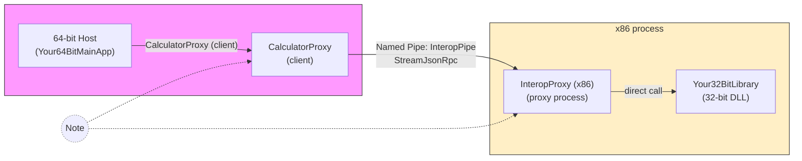

# Architecture Diagram

Below is a compact architecture diagram showing how the 64-bit host calls into the 32-bit library via a separate x86 proxy process, using Named Pipes + StreamJsonRpc as the IPC transport.



If Mermaid is not rendered in your viewer, here is an ASCII fallback:

```
64-bit Host (Your64BitMainApp)
    |
    |-- CalculatorProxy (client)
           |
           |-- Named Pipe "InteropPipe"  (StreamJsonRpc)
                  |
                  |-- InteropProxy (x86 proxy process)
                         |
                         |-- Your32BitLibrary (32-bit DLL)
```

Explanation
- 64-bit Host: The main application running as a 64-bit process. It uses `CalculatorProxy` to perform operations that look local.
- CalculatorProxy: Client-side proxy that connects to the proxy process over a named pipe and uses StreamJsonRpc to invoke async RPC methods (e.g., `AddAsync`).
- InteropProxy: A separate x86 process that hosts a JSON-RPC endpoint bound to a NamedPipeServerStream and forwards calls into the 32-bit library.
- Your32BitLibrary: The existing 32-bit-only assembly containing the actual implementation. It is loaded by the InteropProxy process and called directly there.

Operational notes
- The host and proxy communicate only over local IPC (named pipes). This keeps the 32-bit code isolated and avoids platform mismatch within a single process.
- Use async APIs (`AddAsync`) to avoid sync-over-async deadlocks. The proxy process can be started on demand by the client or managed externally.
- Consider security: restrict named pipe permissions and consider an auth handshake for production.

Place this file in `docs/architecture.md` and reference it from the README if desired.
